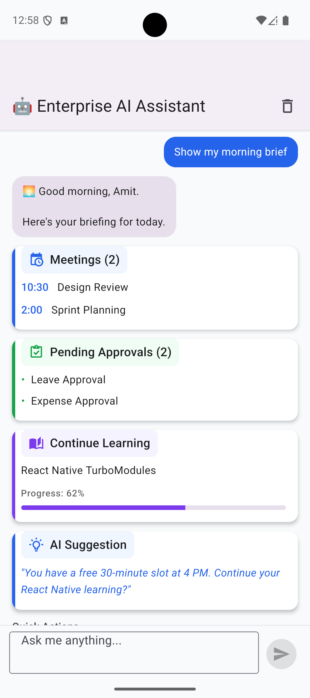
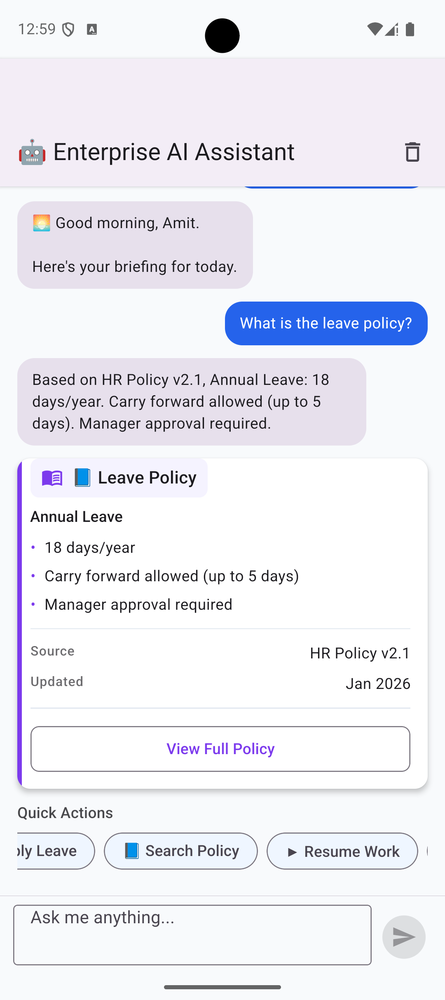

# Enterprise AI Assistant

An AI-powered Enterprise Assistant built with **React Native CLI**, **TypeScript**, and **Google Gemini** that demonstrates how Large Language Models can be combined with deterministic enterprise workflows using a layered architecture.

Instead of allowing AI to control the application, the assistant treats the LLM as a Natural Language Understanding and Generation engine while business logic, workflow execution and UI rendering remain fully deterministic.

## ✨ Features

### 🤖 AI Capabilities

- 🌅 AI-powered Morning Brief with meetings, approvals and learning recommendations
- 🧠 Gemini-powered intent recognition and entity extraction
- 💬 Natural language conversations with multi-turn context
- 📘 Enterprise policy search using a Mini RAG architecture
- ♻ Resume active workflows from previous sessions

### 💼 Enterprise Workflows

- 🌴 Apply Leave using natural language
- ✏️ Modify leave requests conversationally
- ✅ Submit leave requests with deterministic business actions
- 📊 Workflow status and conversation memory using MMKV

### 🏗 Engineering Highlights

- Layered Clean Architecture
- Intent-driven AI orchestration pipeline
- Factory-based GenUI rendering
- Semantic component descriptors
- Swappable AI provider abstraction
- Offline fallback when AI is unavailable

  ## 🎥 Demo

### Morning Brief

Displays today's meetings, pending approvals, learning progress and AI-powered recommendations.

### Enterprise Policy Search

Ask questions naturally:

> What is the leave policy?

> Can I carry forward annual leave?

The assistant retrieves relevant enterprise policies and generates contextual answers using Gemini.

### Leave Workflow

Natural conversation:

```
Apply leave on 25 July because it's my son's birthday.

↓

Leave Draft

↓

Sorry, change it to 26 July.

↓

Updated Draft

↓

Submit

↓

Success
```

### Resume Workflow

The assistant remembers unfinished work using MMKV conversation context and resumes it after reopening the application.

## Stack

- React Native CLI + TypeScript
- Navigation: `@react-navigation/native`, `@react-navigation/native-stack`
- State: Zustand
- Storage: `react-native-mmkv`
- Networking: Axios
- AI: Google Gemini 2.5 Flash (REST, no SDK) via `react-native-config`
- UI: React Native Paper + Vector Icons
- Animation: Reanimated (installed, ready when needed)

## Architecture

### Layer model

```
┌──────────────────────────────────────────────────────────────┐
│                  Presentation Layer                          │
│  Screens • Components • Navigation • Theme • GenUI Renderer  │
└──────────────────────────────┬───────────────────────────────┘
                               │
                               ▼
┌──────────────────────────────────────────────────────────────┐
│                AI Orchestration Layer                        │
│ processMessage • Chat Orchestrator • Zustand • Conversation  │
└──────────────────────────────┬───────────────────────────────┘
                               │
                               ▼
┌──────────────────────────────────────────────────────────────┐
│                  Application Pipeline                        │
│                                                              │
│ Resolve Intent                                               │
│   ├── Workflow Actions (Deterministic)                       │
│   ├── Gemini Intent & Entity Extraction                      │
│   └── Regex Fallback                                         │
│                ↓                                             │
│ Business Actions                                             │
│                ↓                                             │
│ Knowledge Retrieval (Optional)                               │
│                ↓                                             │
│ Gemini Response Phrasing                                     │
│                ↓                                             │
│ Response Parser                                              │
│                ↓                                             │
│ Component Factory                                            │
└──────────────────────────────┬───────────────────────────────┘
                               │
                               ▼
┌──────────────────────────────────────────────────────────────┐
│                     Data Layer                               │
│  Mock APIs • MMKV • Remote APIs • Gemini Provider            │
└──────────────────────────────────────────────────────────────┘
```

### Runtime flow

```
User
│
▼
resolveIntent()
│
├── Workflow Actions (Deterministic)
├── Gemini Extraction
└── Regex Fallback
│
▼
Business Actions
│
▼
Parser
│
▼
Factory
│
▼
Gemini Phrasing
│
▼
Presentation
```
## 🧠 AI Design Philosophy

Unlike traditional AI chat applications, the Large Language Model does **not** control application behavior.

Gemini is intentionally responsible only for:

- Intent Recognition
- Entity Extraction
- Natural Language Responses

The application remains responsible for:

- Business Workflows
- Workflow Validation
- Knowledge Retrieval
- State Management
- Component Selection
- UI Rendering
- Local Persistence

This architecture keeps enterprise workflows deterministic, reliable and testable while still benefiting from modern LLM capabilities.
Gemini is used **exactly twice** per user message — once for intent + entity extraction, once for friendly response phrasing. Everything else (actions, card descriptors, factory, workflow buttons) stays deterministic. Workflow button clicks (`Submit`, `Modify`, `Cancel`) bypass Gemini and use deterministic keyword detection.

| Step | Location | Entry point |
|------|----------|-------------|
| User Prompt | `src/presentation/` | `ChatScreen` → `chatStore.sendMessage()` |
| Intent Resolution | `src/application/intents/` | `resolveIntent.ts` |
| Gemini Extraction | `src/application/provider/` | `extractIntent.ts` + `GeminiProvider.ts` |
| Business Action | `src/application/actions/` | `executeAction()` in `actions/index.ts` |
| Knowledge Retrieval | `src/application/retrieval/` | `retrieveKnowledge.ts` |
| Card Descriptors | `src/application/provider/` | `generateResponse.ts` (deterministic) |
| Gemini Phrasing | `src/application/provider/` | `phraseResponse.ts` |
| Response Parser | `src/application/parser/` | `parseResponse.ts` |
| Component Factory | `src/application/factory/` | `componentFactory.ts` |
| GenUI Renderer | `src/presentation/components/chat/` | `GenUIRenderer.tsx` |

The AI orchestration layer (`processMessage.ts`) wires the pipeline together. The parser extracts semantic descriptors from LLM output; the factory decides which React Native card components to build.

### Leave workflow (end-to-end)

A full leave request in three steps — apply, modify with conversation memory, submit.

```
Step 1 — Apply          Step 2 — Modify              Step 3 — Submit
─────────────────       ─────────────────────        ─────────────────
User: natural language  User: "Sorry its on         User: "Submit leave draft"
                        25th july"
      │                        │                            │
      ▼                        ▼                            ▼
Gemini extraction       MMKV context loaded           Deterministic keyword
apply_leave + entities  modify_leave + date           submit_leave
      │                        │                            │
      ▼                        ▼                            ▼
applyLeave()            mergeDraftUpdates()           submitLeaveAction()
draft → MMKV            same draftId updated          mock API → reference
      │                        │                            │
      ▼                        ▼                            ▼
LeaveDraftCard          LeaveDraftCard (updated)      SuccessCard
```

#### 1. Apply leave


**User:** `Apply leave on 24july its my son's`

1. **Gemini extraction** → `{ intent: "apply_leave", entities: { date: "2026-07-24", reason: "son's birthday" } }`
2. **Action** → `applyLeave()` saves draft to MMKV with `draftId: "LV-DRAFT-001"`
3. **Factory** → `LeaveDraftCard` (date, reason, balance, approver)
4. **Gemini phrasing** → *"Your leave request for July 24..."*

#### 2. Modify with conversation memory


**User:** `Sorry its on 25th july`

Conversation context is already in MMKV:

```json
{
  "activeWorkflow": "leave",
  "draftId": "LV-DRAFT-001",
  "status": "draft",
  "draft": { "date": "2026-07-24", "reason": "son's birthday", ... }
}
```

1. **Gemini extraction** (prompt includes active draft) → `{ intent: "modify_leave", entities: { date: "2026-07-25" } }`
2. **Action** → `modifyLeave()` merges only the changed date into the existing draft — same `draftId`, reason preserved
3. **Factory** → same `LeaveDraftCard` re-rendered with **25 July 2024**
4. **Gemini phrasing** → *"Certainly! I'm updating your leave for July 25th..."*

No new card type. No regex. The assistant remembers what you were working on.

#### 3. Submit leave


**User:** `Submit leave draft`

1. **Intent** → `detectWorkflowAction()` matches keyword — **no Gemini** (deterministic)
2. **Action** → `submitLeaveAction()` calls mock API, returns `LV-2026-00127`
3. **Factory** → `SuccessCard` with reference, status, expected approval
4. **Gemini phrasing** → *"Your leave request, LV-2026-00127, has been submitted..."*

Context updates to `status: "submitted"`. **[View Status]** and **[Done]** route through the same `sendMessage()` pipeline.

### Gemini under the hood


*DevTools view of both Gemini REST calls per message — extraction (structured JSON) and phrasing (friendly chat bubble). Card descriptors (`workflow_draft`, `workflow_success`) are built deterministically from action payloads.*

## 🏛 Architecture Principles

- Layered Architecture
- Single Responsibility Principle (SRP)
- AI-first orchestration pipeline
- Intent-driven business workflows
- Semantic UI descriptors
- Factory-based GenUI rendering
- Swappable AI providers
- Repository Pattern
- Offline-first conversation persistence using MMKV

## 🚀 Key Capabilities

| Capability | Description |
|------------|-------------|
| Morning Brief | AI-generated enterprise dashboard |
| Policy Search | Mini RAG over enterprise policies |
| Leave Workflow | End-to-end conversational workflow |
| Conversation Memory | Resume unfinished workflows |
| Offline Support | Regex fallback when AI is unavailable |
| Dynamic GenUI | Factory-generated React Native components |

## Project structure

```
src/
  presentation/
    screens/
    components/
      cards/          ActionCard, InfoCard, BriefCard
      chat/           GenUIRenderer, ChatInput, MessageBubble
    navigation/
    theme/

  application/
    orchestrator/     processMessage, chatOrchestrator, chatStore
    intents/          resolveIntent, detectConversationModify, detectWorkflowAction
    actions/          applyLeave, submitLeave, leaveWorkflow, leaveDraftUtils
    context/          conversationContext (MMKV)
    retrieval/        retrieveKnowledge
    provider/         GeminiProvider, extractIntent, phraseResponse, generateResponse
    parser/           parseResponse
    factory/          buildComponents
    usecases/

  domain/
    entities/
    repository/

  data/
    datasource/
      mock/
      local/
      remote/
    repository/

  core/
    config/
    constants/
    storage/
    network/
    utils/

  assets/
```
## 📸 Screenshots

| Morning Brief | Policy Search |
|---------------|---------------|
|  |  |

| Leave Draft | Modify Request |
|--------------|----------------|
|  |  |

| Leave Submitted |
|-----------------|
|  |

## Getting started

```bash
npm install
```

### iOS setup

macOS ships with an old system Ruby (2.6) that often fails to compile CocoaPods gems. Use Homebrew Ruby instead:

```bash
export PATH="/opt/homebrew/opt/ruby/bin:$PATH"
export LANG=en_US.UTF-8
export LC_ALL=en_US.UTF-8

bundle install
cd ios && bundle exec pod install && cd ..
```

Then start Metro and run the app:

```bash
npm start
npm run ios    # or npm run android
```

## Configuration

### Gemini API key

Copy `.env.example` to `.env` and set your key:

```bash
GEMINI_API_KEY=your_key_here
```

Never commit `.env`. Rebuild the native app after changing env vars (`npm run ios` / `npm run android`).

When `GEMINI_API_KEY` is set, the app uses Gemini for extraction and phrasing. Without it, the pipeline falls back to regex-based intent detection and deterministic messages.

### Backend

Set `useMockData: false` and update `apiBaseUrl` in `src/core/config/appConfig.ts` when your backend is available.

## Key entry points

| File | Purpose |
|------|---------|
| `src/application/orchestrator/processMessage.ts` | Full GenUI pipeline |
| `src/application/intents/resolveIntent.ts` | Workflow → Gemini → regex intent resolution |
| `src/application/intents/detectConversationModify.ts` | Context-aware modify detection fallback |
| `src/application/context/conversationContext.ts` | MMKV conversation memory (`draftId`, draft, status) |
| `src/application/provider/GeminiProvider.ts` | Axios REST to Gemini 2.5 Flash |
| `src/application/provider/extractIntent.ts` | Intent + entity extraction prompt |
| `src/application/provider/phraseResponse.ts` | Friendly response phrasing prompt |
| `src/application/provider/generateResponse.ts` | Deterministic descriptors + Gemini message |
| `src/application/parser/parseResponse.ts` | Extract descriptors from LLM output |
| `src/application/factory/componentFactory.ts` | Map descriptors → card components |
| `src/presentation/components/chat/GenUIRenderer.tsx` | Render factory output |

## 🔮 Future Enhancements

The architecture has been intentionally designed for future enterprise integrations.

Potential extensions include:

- Microsoft Graph integration
- Azure AI Search / Pinecone Vector Database
- Calendar synchronization
- Enterprise authentication (Azure AD / Okta)
- HRMS integration
- Expense approval workflow
- Meeting scheduling workflow
